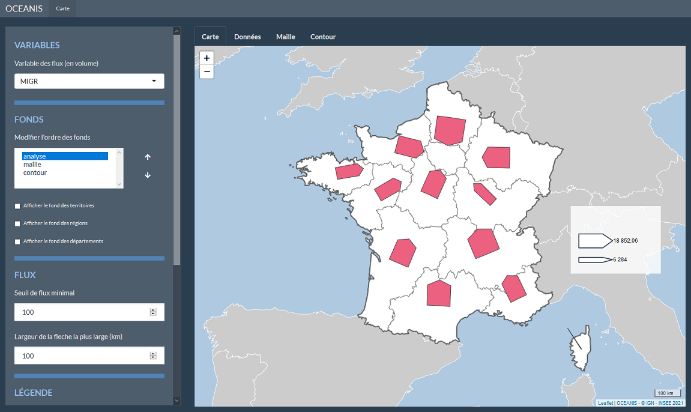
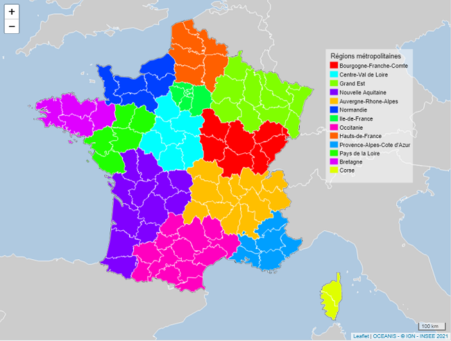
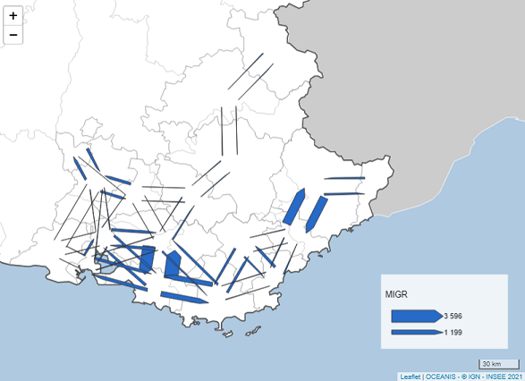
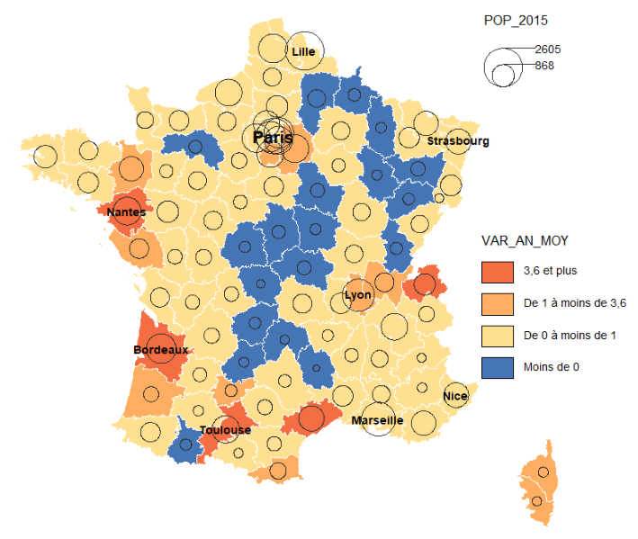

# oceanis-package (version 1.7.5.1)
[](https://github.com/SNStatComp/awesome-official-statistics-software)
[](https://cran.r-project.org/package=oceanis)

Le package _oceanis_ permet de réaliser des cartes d'analyses. Il propose plusieurs représentations cartographiques possibles :
+ ronds proportionnels
+ analyse en classes (ou choroplètes)
+ ronds proportionnels sur une analyse en classes
+ analyse en classes sur des ronds proportionnels
+ typologie par couleurs et par symboles
+ oursins
+ flèches joignantes (ou flèches proportionnelles)
+ flèches saphirs

Le package _oceanis_ répond à 3 types de besoins :

1. Créer des cartes fixes avec la possibilité d'ajouter des étiquettes. Idéal pour les sorties de documents (.pdf ou autres). Peut être intégré dans les applications.

2. Créer des cartes interactives grâce au zoom et aux pop-up (technologie _leaflet_). Utile pour l'intégration dans une application ou dans une présentation en direct.

3. Créer des cartes dans un environnement web ou les paramètres sont modifiables à la volée (technologie _R-Shiny_ + _leaflet_). Utile pour l'intégration dans une application ou dans une présentation en direct. Ici, la carte est externalisée vers une nouvelle fenêtre du navigateur.

Les fonctions sont classées en 3 groupes, correspondant aux 3 besoins précédents (_plot__, _leaflet__, et _shiny__).

D'autres fonctions existent pour compléter l'offre :
+ Exporter une carte leaflet en projet Qgis
+ Modifier l'apparence de la carte
+ Créer ses propres zonages (connus ou à facon) à partir de tableaux de données.

Le package _oceanis_ répond à des besoins bien spécifiques autant que d'autres packages dédiés à la cartographie (_ggplot2_, _cartography_, _tmap_, _leaflet_, _mapview_...). Son utilisation se veut la plus simple et rapide possible tout en proposant une large palette de fonctionnalités.

L'aide du package et la vignette proposent des exemples de réalisation de cartes à partir de données préchargées.

La vignette propose notamment un exemple de scénario de réalisation de cartes depuis le chargement des données et des fonds jusqu'à son exportation en fichier image ou en projet Qgis.

Pour installer le package _oceanis_ depuis GitHub et le charger dans R :
```r
devtools::install_github("insee-psar-at/oceanis-package")
library(oceanis)
```
ou à partir du CRAN :
```r
install.packages("oceanis")
library(oceanis)
```

Ci-dessous quelques exemples de cartes réalisées avec le package _oceanis_ :

- Fonction _shiny_classes_ronds_


- Fonction _shiny_saphirs_



- Fonctions _leaflet_ronds_classes_, _add_legende_classes_ et _add_legende_ronds_


- Fonctions _leaflet_typo_ et _add_legende_typo_



- Fonctions _leaflet_fonds_simples_, _add_typo_symboles_ et _add_legende_typo_symboles_


- Fonctions _leaflet_joignantes_ et _add_legende_joignantes_



- Fonctions _plot_classes_ronds_ et _coordonnees_etiquettes_



