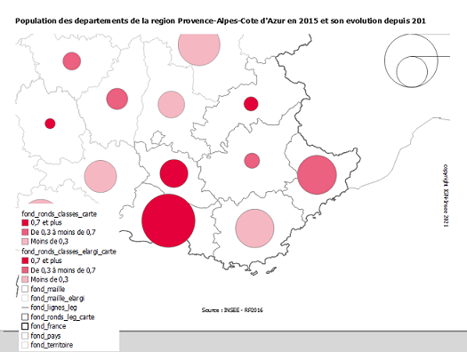

```{r echo=FALSE}
knitr::opts_chunk$set(collapse = TRUE)
```

# Package oceanis

Realiser des cartes d'etudes et d'analyses a partir de donnees mono ou bilocalisees.

**Monolocalisees**

+ ronds proportionnels pour des donnees en volume

+ analyse en classes pour des donnees en ratio

+ typologie pour des donnees categorisees

**Bilocalisees**

+ oursins pour des flux entre deux territoires

+ fleches joignantes pour des flux entre deux territoires, leurs volumes et leurs directions

+ fleches saphirs pour des flux d'entrees et de sorties d'un territoire par rapport a d'autres

# Preparation des donnees

## Chargement des donnees

Pour charger des donnees, le package `rio` permet d'importer des fichiers de formats differents (csv, sas, xls, dbf, rda, rds, html, xml, ods...).

La fonction `import(file)` permet d'importer le fichier de donnees.


```{r}
donnees_monoloc <- rio::import(file = system.file("data/donnees_monoloc.rda",
                                                  package = "oceanis"))
```

Pour information, la table `donnees_monoloc` est un data.frame contenant 6 variables, le code des departements, les libelles, la population en 2010, en 2015, la variation annuelle moyenne de la population entre 2010 et 2015 et le code region d'appartenance. Son champ est la France metropolitaine.

## Creation des variables de classes

Pour calculer une variable de classes a partir de variables en volume presentes dans le tableau de donnees, vous pouvez passer par l'une des fonctions suivantes :

+ calcul_ratio(data, var1, var2) pour calculer un ratio entre 2 variables en volume ;

+ calcul_tx_evol_global(data, var1, var2) pour calculer le taux d'evolution global entre deux periodes ;

+ calcul_tx_evol_ann_moy(data, var1, var2, nbAnnees) pour calculer le taux d'evolution annuel moyen entre deux periodes ;

+ calcul_part_ens(data, var) pour calculer la part dans l'ensemble ;

+ calculette(data, formule = NULL) pour entrer manuellement votre propre formule de calcul ;

Ces fonctions ajoutent au tableau de donnees la colonne de variable de classes.

Vous pouvez egalement visualiser la distribution d'une variable de classes :

```{r, fig.width = 5}
library(oceanis)

# chargement des donnees
donnees_monoloc <- rio::import(file = system.file("data/donnees_monoloc.rda",
                                                  package = "oceanis"))
# visualisation de la distribution de la variable VAR_AN_MOY
distrib_variable(data = donnees_monoloc,
                 varRatio = "VAR_AN_MOY",
                 nbClasses = 4)
```

# Preparation des fonds de carte

## Chargement des fonds de carte

Les objets geometriques utilises dans les fonctions du package "oceanis" sont des objets `sf` issus du package `sf` (Simple Features for R).

En plus de la geometrie, les objets sf peuvent contenir des donnees de type data.frame ou tibble.

Pour charger un fond de carte de format ShapeFile (.shp) en un objet R de format sf, il suffit d'appeler la fonction `sf::read_sf` ou `sf::st_read`.

```{r fondCarte, fig.height = 3, fig.width = 3}
# chemin du fond de carte .shp
path_to_shp <- system.file("extdata",
                           "dep_francemetro_2018.shp",
                           package = "oceanis")
# import de l'objet sf
depm <- sf::st_read(dsn = path_to_shp, quiet = TRUE)

# visualisation de la geometrie
# modification des marges
par(mai = c(0,0,0,0))
# contour des departements de France metropolitaine
plot(sf::st_geometry(depm))
```

## Creation d'un zonage a facon

Vous n'avez pas a votre disposition de fond de carte .shp correspondant a votre zonage d'etudes. Vous pouvez le generer a partir d'autres fonds de carte disponibles. Par exemple, a partir de zonages administratifs (communes, departements, regions...) ou d'etudes (intercommunalites, aires urbaines, zones d'emploi...).

La fonction `zonage_a_facon` permet de creer son propre zonage a facon.

L'exemple ci-dessous permet de resconstituer les zones d'emploi des Bouches-du-Rhcne a partir d'un fond communal.

```{r zonageAFacon, fig.height = 5, fig.width = 5}
library(oceanis)

# chargement des donnees :
# donnees a facon avec variable de regroupement (ZE2010)
donnees_a_facon <- rio::import(file = system.file("data/donnees_a_facon.rda",
                                                  package = "oceanis"))
# fond communal des departements 13, 30, 83 et 84
com_dep_13_30_83_84 <- sf::st_as_sf(rio::import(file = system.file("data/com_dep_13_30_83_84.rda",
                                                      package = "oceanis")))

# chemin du fond de carte .shp
path_to_shp <- system.file("extdata",
                           "dep_francemetro_2018.shp",
                           package = "oceanis")
# import en objet sf
depm <- sf::st_read(dsn = path_to_shp, quiet = TRUE, stringsAsFactors = FALSE)

# creation du zonage des zones d'emploi des Bouches-du-Rhone (partie entiere des ze)
ze13etplus <- zonage_a_facon(fondMaille = com_dep_13_30_83_84,
                             groupe = donnees_a_facon,
                             idMaille = "DEPCOM",
                             idGroupe = "ZE2010",
                             libGroupe = "LIB_ZE2010",
                             fondContour = NULL)
# creation du zonage des zones d'emploi des Bouches-du-Rhone (partie tronquee des ze au contour du departement)
ze13 <- zonage_a_facon(fondMaille = com_dep_13_30_83_84,
                       groupe = donnees_a_facon,
                       idMaille = "DEPCOM",
                       idGroupe = "ZE2010",
                       libGroupe = "LIB_ZE2010",
                       fondContour = depm[depm$code=="13",])

# visualisation de la geometrie
# modification des marges
par(mai = c(0,0,0,0))
# fond des ze des Bouches-du-Rhone en 1er pour fixer le niveau de zoom, en bleu
plot(sf::st_geometry(ze13etplus),
     col = "powderblue",
     border = "transparent")
# fond de la partie tronquee des ze des Bouches-du-Rhone, en rouge
plot(sf::st_geometry(ze13),
     col = "lightsalmon",
     border = "transparent",
     add = TRUE)
# contour des communes
plot(sf::st_geometry(com_dep_13_30_83_84),
     col = "transparent",
     border = "lavender",
     add = TRUE)
# contour de la partie tronquee des ze des Bouches-du-Rhone, en rouge
plot(sf::st_geometry(ze13),
     col = "transparent",
     border = "indianred",
     lwd = 3,
     add = TRUE)
# contour des ze des Bouches-du-Rhone, en bleu
plot(sf::st_geometry(ze13etplus),
     col = "transparent",
     border = "steelblue",
     lwd = 3,
     add = TRUE)
```


# Creation de cartes avec les fonctions shiny_()

Les fonctions shiny_() permettent de visualiser les cartes dans un environnement web utilisant la technologie R-Shiny (package `shiny` Web Application Framework for R). Cet environnement permet de modifier a la volee le parametrage de la carte (nombre de classes, methode de calcul des classes, taille des ronds, des fleches, filtres sur les donnees etc...). La carte est alors actualisee a chaque modification de parametres.

Les cartes sont interactives car elles sont dans le format leaflet (package `leaflet` Leaflet for R). Il est possible de se deplacer, de zoomer sur la carte et de cliquer sur les territoires pour faire apparaitre des informations sous forme d'info-bulles (ou pop-up).

Voici deux exemples de cartes realisees avec les fonctions shiny_classes_ronds() pour une representation de donnees monolocalisees avec des ronds propotionnels sur une analyse en classes et shiny_joignantes() pour une representation de donnees bilocalisees avec visualisation de la direction et du volume du flux.

```{r shinyRondsAnalyseClasses, eval = FALSE}
library(oceanis)
library(shiny)

# chargement des donnees
donnees_monoloc <- rio::import(file = system.file("data/donnees_monoloc.rda",
                                                  package = "oceanis"))

# import du fond des departements
depm <- sf::st_read(dsn = system.file("extdata",
                                      "dep_francemetro_2018.shp",
                                      package = "oceanis"),
                    quiet = TRUE,
                    stringsAsFactors = FALSE)
# import du fond des regions
regm <- sf::st_read(dsn = system.file("extdata",
                                      "reg_francemetro_2018.shp",
                                      package = "oceanis"),
                    quiet = TRUE,
                    stringsAsFactors = FALSE)
# import du fond de France metropolitaine
fram <- sf::st_read(dsn = system.file("extdata",
                                      "francemetro_2018.shp",
                                      package = "oceanis"),
                    quiet = TRUE,
                    stringsAsFactors = FALSE)

shiny_classes_ronds(data = donnees_monoloc,
                    fondMaille = depm[depm$reg %in% c("93","94"),],
                    fondMailleElargi = depm,
                    fondContour = fram,
                    fondSuppl = regm,
                    idData = "COD_DEP",
                    varVolume = "POP_2015",
                    varRatio = "VAR_AN_MOY")
```


```{r shinyJoignantes, eval = FALSE}
library(oceanis)
library(shiny)

# chargement des donnees
donnees_biloc <- rio::import(file = system.file("data/donnees_biloc.rda",
                                                package = "oceanis"))

# import du fond des regions
regm <- sf::st_read(dsn = system.file("extdata",
                                      "reg_francemetro_2018.shp",
                                      package = "oceanis"),
                    quiet = TRUE,
                    stringsAsFactors = FALSE)
# import du fond des departements
depm <- sf::st_read(dsn = system.file("extdata",
                                      "dep_francemetro_2018.shp",
                                      package = "oceanis"),
                    quiet = TRUE,
                    stringsAsFactors = FALSE)
# import du fond de France metropolitaine
fram <- sf::st_read(dsn = system.file("extdata",
                                      "francemetro_2018.shp",
                                      package = "oceanis"),
                    quiet = TRUE,
                    stringsAsFactors = FALSE)

shiny_joignantes(data = donnees_biloc,
                 fondMaille = regm,
                 typeMaille = "REG",
                 fondContour = fram,
                 fondSuppl = depm,
                 idDataDepart = "REG_DEPART",
                 idDataArrivee = "REG_ARRIVEE",
                 varFlux = "MIGR",
                 decalageAllerRetour = 10,
                 decalageCentroid = 20)
```


# Creation de cartes avec les fonctions leaflet_()

Les fonctions leaflet_() proposent des cartes en sorties utilisant la technologie leaflet (package `leaflet` Leaflet for R) comme pour les fonctions shiny. Ces fonctions sont davantage parametrables et la modification des cartes (ajout d'une legende, modification de couleurs, etc...) est possible par d'autres fonctions dediees.

Ci-dessous, un exemple de cheminement possible pour realiser une carte complete avec leaflet. Cette carte utilise des donnees monolocalisees avec une analyse en classes dans les ronds. Appeler l'objet `map` dans la console a chaque etape pour afficher la carte.

```{r leafletAnalyseClassesRonds, fig.height = 6, fig.width = 9}
library(oceanis)
library(leaflet)

# chargement des donnees
donnees_monoloc <- rio::import(file = system.file("data/donnees_monoloc.rda",
                                                  package = "oceanis"))

# import du fond des departements
depm <- sf::st_read(dsn = system.file("extdata",
                                      "dep_francemetro_2018.shp",
                                      package = "oceanis"),
                    quiet = TRUE,
                    stringsAsFactors = FALSE)
# import du fond des regions
regm <- sf::st_read(dsn = system.file("extdata",
                                      "reg_francemetro_2018.shp",
                                      package = "oceanis"),
                    quiet = TRUE,
                    stringsAsFactors = FALSE)

# affichage de la carte
map <- leaflet_ronds_classes(data = donnees_monoloc,
                             fondMaille = depm[depm$reg=="93",],
                             fondMailleElargi = depm,
                             fondSuppl = regm,
                             idData = "COD_DEP",
                             varVolume = "POP_2015",
                             varRatio = "VAR_AN_MOY")

# affichage du rayon du rond le plus grand en metres
rayon_ronds(map)

# affichage de la carte avec des rayons de ronds plus grands
map <- leaflet_ronds_classes(data = donnees_monoloc,
                             fondMaille = depm[depm$reg == "93",],
                             fondMailleElargi = depm,
                             fondSuppl = regm,
                             idData = "COD_DEP",
                             varVolume = "POP_2015",
                             varRatio = "VAR_AN_MOY",
                             rayonRond = 29000,
                             rapportRond = NULL)

# affichage du rapport du rond le plus grand, a recuperer pour permettre la comparaison de plusieurs cartes
rapport_ronds(map)

# ajout de la legende des ronds (position par defaut)
map <- add_legende_ronds(map = map,
                         titre = "Population en 2015",
                         zoom = 6)
# ajout de la legende des classes (position par defaut)
map <- add_legende_classes(map = map,
                           titre = "Variation ann.moy. 2010-2015",
                           zoom = 6)

# modification de la position de la legende des ronds et du niveau de zoom
map <- add_legende_ronds(map = map,
                         titre = "Population en 2015",
                         lng = 8,
                         lat = 44,
                         zoom = 8)
# modification de la position de la legende des classes et du niveau de zoom
map <- add_legende_classes(map = map,
                           titre = "Variation ann.moy. 2010-2015",
                           lng = 7.5,
                           lat = 43.5,
                           zoom = 8)

# ajout d'une source a la carte
map <- add_source(map = map,
                  source = "Source : INSEE - RP2016")
# ajout d'un titre a la carte
map <- add_titre(map = map,
                 titre = "Population des departements de la region Provence-Alpes-Cote d'Azur en 2015 et son evolution depuis 2010")

# affichage de la palette par defaut
recup_palette(stylePalette = "defaut")

# affichage de la palette InseePremiere
recup_palette(stylePalette = "InseePremiere")

# modification du style de la palette et de la bordure des ronds
map <- set_couleur_classes(map = map,
                           stylePalette = "InseePremiere",
                           colBorder = "grey")

# modification de l'opacite de la representation elargie
map <- set_opacite_elargi(map = map,
                          opacite = 0.3)

# ajout d'un fond OpenStreetMap
map <- add_fond_osm(map)
```


# Creation de cartes avec les fonctions plot_()

Les fonctions plot_() sont hautement parametrables. Les cartes en sortie ne sont pas interactives mais leur plus-value reside dans la possibilite d'ajouter des etiquettes.
Il est possible egalement d'ajouter autant de fonds que l'on souhaite sous ou sur la couche d'analyse.

Le style des fonds ajoutes et des etiquettes est parametrable.
Les fonctions plot_() retournent le fond brut de l'analyse (ronds, maille ou fleches).

L'exemple suivant montre comment construire une carte avec des fleches saphirs en utilisant la fonction plot_saphirs().

```{r plotSaphirs, fig.height = 6, fig.width = 7}
library(oceanis)

# chargement des donnees
donnees_biloc_saphirs <- rio::import(file = system.file("data/donnees_biloc_saphirs.rda",
                                                        package = "oceanis"))

# import du fond des regions
regm <- sf::st_read(dsn = system.file("extdata",
                                      "reg_francemetro_2018.shp",
                                      package = "oceanis"),
                    quiet = TRUE,
                    stringsAsFactors = FALSE)
# import du fond de France metropolitaine
fram <- sf::st_read(dsn = system.file("extdata",
                                      "francemetro_2018.shp",
                                      package = "oceanis"), 
                    quiet = TRUE,
                    stringsAsFactors = FALSE)
# import du fond des pays
paysm <- sf::st_read(dsn = system.file("extdata",
                                       "paysf_2018.shp",
                                       package = "oceanis"),
                     quiet = TRUE,
                     stringsAsFactors = FALSE)
# import du fond de mer
merm <- sf::st_read(dsn = system.file("extdata",
                                      "merf_2018.shp",
                                      package = "oceanis"),
                    quiet = TRUE,
                    stringsAsFactors = FALSE)

# affichage de la carte
fond_saphirs <- plot_saphirs(data = donnees_biloc_saphirs,
                             fondMaille = regm,
                             typeMaille = "REG",
                             idDataDepart = "REG_DEPART",
                             idDataArrivee = "REG_ARRIVEE",
                             varFlux = "MIGR",
                             direction = "Ent",
                             titreLeg = "Entrees",
                             xLeg = 1100000,
                             yLeg = 6470000,
                             titreCarte = "Migrations residentielles vers l'Ile-de-France",
                             sourceCarte = "Source : INSEE - RP2016",
                             colEntree = "#D2691E",
                             colBorder = "transparent",
                             colBorderMaille = "grey")

# construction de la table des etiquettes
etiquettes <- coordonnees_etiquettes(fondMaille = regm,
                                     listeCode = as.character(regm$code))
# modification des valeurs (latitude Y, longitude X, taille, couleur et style de police)
etiquettes[etiquettes$CODE=="24","Y"] <- 6680000
etiquettes[etiquettes$CODE=="27","Y"] <- 6660000
etiquettes[etiquettes$CODE=="28","X"] <- 410000
etiquettes[etiquettes$CODE=="32","Y"] <- 7015000
etiquettes[etiquettes$CODE=="44","X"] <- 955000
etiquettes[etiquettes$CODE=="52","X"] <- 330000
etiquettes[etiquettes$CODE=="52","Y"] <- 6700000
etiquettes[etiquettes$CODE=="53","X"] <- 215000
etiquettes[etiquettes$CODE=="75","Y"] <- 6420000
etiquettes[etiquettes$CODE=="76","Y"] <- 6270000
etiquettes[etiquettes$CODE=="84","Y"] <- 6455000
etiquettes[etiquettes$CODE=="93","Y"] <- 6290000
etiquettes[etiquettes$CODE=="94","Y"] <- 6120000
etiquettes[etiquettes$CODE!="11","TAILLE"] <- 0.6
etiquettes[etiquettes$CODE=="11","COL"] <- "#002D7F"
etiquettes[etiquettes$CODE!="11","FONT"] <- 1

# affichage de la carte
fond_saphirs <- plot_saphirs(data = donnees_biloc_saphirs,
                             fondMaille = regm,
                             typeMaille = "REG",
                             idDataDepart = "REG_DEPART",
                             idDataArrivee = "REG_ARRIVEE",
                             varFlux = "MIGR",
                             direction = "Ent",
                             titreLeg = "Entrees",
                             xLeg = 1150000,
                             yLeg = 6470000,
                             titreCarte = "Migrations residentielles vers l'Ile-de-France",
                             sourceCarte = "Source : INSEE - RP2016",
                             etiquettes = etiquettes,
                             colEntree = "#D2691E",
                             colBorder = "transparent",
                             colBorderMaille = "grey")

# ajout de colonnes dans les fonds pour modifier leur apparence
# couleur de remplissage : COL
# couleur des contours : BORDER
# epaisseur des contours : EPAISEEUR
merm$COL <- "lightsteelblue"
merm$BORDER <- "lightsteelblue"
paysm$COL <- "gray"
paysm$BORDER <- "white"
fram$BORDER <- "darkgray"
fram$EPAISSEUR <- 2

# creation des listes des fonds d'habillage, en-dessous et au-dessus de l'analyse
fondSousAnalyse <- list(merm,paysm)
fondSurAnalyse <- list(fram)

# affichage de la carte
fond_saphirs <- plot_saphirs(data = donnees_biloc_saphirs,
                             fondMaille = regm,
                             fondSousAnalyse = fondSousAnalyse,
                             fondSurAnalyse = fondSurAnalyse,
                             typeMaille = "REG",
                             idDataDepart = "REG_DEPART",
                             idDataArrivee = "REG_ARRIVEE",
                             varFlux = "MIGR",
                             direction = "Ent",
                             titreLeg = "Entrees",
                             xLeg = 1150000,
                             yLeg = 6470000,
                             titreCarte = "Migrations residentielles vers l'Ile-de-France",
                             sourceCarte = "Source : INSEE - RP2016",
                             etiquettes = etiquettes,
                             colEntree = "#D2691E",
                             colBorder = "transparent",
                             colBorderMaille = "grey")

```


# Export de la carte

## En fichier plat (.png, .jpg, .pdf)

### Avec les fonctions shiny_()

Il n'est pas possible d'exporter automatiquement la carte dans un format image ou en pdf.

Manuellement, il faut proceder a une capture d'ecran de la carte puis l'enregistrer dans le format souhaite.

### Avec les fonctions leaflet_()

Il existe 3 fonctions d'export de carte :

+ `export_jpeg(map, chemin, nomFichier)` : pour exporter la carte leaflet en format image .jpg

+ `export_png(map, chemin, nomFichier)` : pour exporter la carte leaflet en format image .png

+ `export_pdf(map, chemin, nomFichier)` : pour exporter la carte leaflet en format .pdf

### Avec les fonctions plot_()

Manuellement, on peut soit effectuer une capture d'ecran, soit utiliser la fonctionnalite "export" de RStudio de l'onglet Plots.


Pour automatiser l'export d'une carte realisee avec une fonction plot_(), il est possible de rediriger la sortie de la fonction dans un dossier specifique. Le package `grDevices` propose plusieurs sorties (.bmp, .jpeg, .png ou .tiff)

```{r exportImage, eval = FALSE}

library(grDevices)

jpeg(filename = "sortie.jpg",
     quality = 100,
     width = 16,
     height = 18,
     units = "cm",
     res = 120)
  
# affichage de la carte
fond_saphirs <- plot_saphirs(data = donnees_biloc_saphirs,
                             fondMaille = regm,
                             fondSousAnalyse = fondSousAnalyse,
                             fondSurAnalyse = fondSurAnalyse,
                             typeMaille = "REG",
                             idDataDepart = "REG_DEPART",
                             idDataArrivee = "REG_ARRIVEE",
                             varFlux = "MIGR",
                             direction = "Ent",
                             titreLeg = "Entrees",
                             xLeg = 1150000,
                             yLeg = 6470000,
                             titreCarte = "Migrations residentielles vers l'Ile-de-France",
                             sourceCarte = "Source : INSEE - RP2016",
                             etiquettes = etiquettes,
                             colEntree = "#D2691E",
                             colBorder = "transparent",
                             colBorderMaille = "grey")

dev.off()

pdf(file = "sortie.pdf",
    width = 10,
    height = 10)
  
# affichage de la carte
fond_saphirs <- plot_saphirs(data = donnees_biloc_saphirs,
                             fondMaille = regm,
                             fondSousAnalyse = fondSousAnalyse,
                             fondSurAnalyse = fondSurAnalyse,
                             typeMaille = "REG",
                             idDataDepart = "REG_DEPART",
                             idDataArrivee = "REG_ARRIVEE",
                             varFlux = "MIGR",
                             direction = "Ent",
                             titreLeg = "Entrees",
                             xLeg = 1150000,
                             yLeg = 6470000,
                             titreCarte = "Migrations residentielles vers l'Ile-de-France",
                             sourceCarte = "Source : INSEE - RP2016",
                             etiquettes = etiquettes,
                             colEntree = "#D2691E",
                             colBorder = "transparent",
                             colBorderMaille = "grey")

dev.off()
```

## En projet Qgis

### Avec les fonctions shiny_()

Pour exporter la carte en projet Qgis (.qgs), dans le panneau de gauche il faut cliquer sur le bouton "Exporter en projet Qgis" puis specifier le nom du projet. Un titre descriptif et informatif peuvent etre donnes. La source peut etre aussi personnalisee. Le choix du dossier en sortie se fait apres avoir clique sur "Exporter".


### Avec les fonctions leaflet_()

Il existe une fonction d'export Qgis pour chacune des huit representations cartographiques.

Avant d'exporter la carte, il faut avoir poser la legende.

```{r exportQgis, eval = FALSE}
library(oceanis)
library(leaflet)

# chargement des donnees
donnees_monoloc <- rio::import(file = system.file("data/donnees_monoloc.rda",
                                                  package = "oceanis"))

# import du fond des departements
depm <- sf::st_read(dsn = system.file("extdata",
                                      "dep_francemetro_2018.shp",
                                      package = "oceanis"),
                    quiet = TRUE,
                    stringsAsFactors = FALSE)
# import du fond des regions
regm <- sf::st_read(dsn = system.file("extdata",
                                      "reg_francemetro_2018.shp",
                                      package = "oceanis"),
                    quiet = TRUE,
                    stringsAsFactors = FALSE)

# affichage de la carte avec des rayons de ronds plus grands
map <- leaflet_ronds_classes(data = donnees_monoloc,
                             fondMaille = depm[depm$reg == "93",],
                             fondMailleElargi = depm,
                             fondSuppl = regm,
                             idData = "COD_DEP",
                             varVolume = "POP_2015",
                             varRatio = "VAR_AN_MOY",
                             rayonRond = 29000,
                             rapportRond = NULL)

# modification de la position de la legende des ronds et du niveau de zoom
map <- add_legende_ronds(map = map,
                         titre = "Population en 2015",
                         lng = 8.5,
                         lat = 45,
                         zoom = 8)
# modification de la position de la legende des classes et du niveau de zoom
map <- add_legende_classes(map = map,
                           titre = "Variation ann.moy. 2010-2015",
                           lng = 8,
                           lat = 44.5,
                           zoom = 8)
# ajout d'une source a la carte
map <- add_source(map = map,
                  source = "Source : INSEE - RP2016")
# ajout d'un titre a la carte
map <- add_titre(map = map,
                 titre = "Population des departements de la region Provence-Alpes-Cote d'Azur en 2015 et son evolution depuis 2010")
# modification de la couleur de bordure des ronds
map <- set_couleur_ronds(map = map,
                         colBorderPos = "grey")
# modification du style de la palette
map <- set_couleur_classes(map = map,
                           stylePalette = "InseePremiere")
# modification de l'opacite de la representation elargie
map <- set_opacite_elargi(map,
                          opacite = 0.3)

export_qgis_ronds_classes(map,
                          cheminDossier = getwd(),
                          nomFichier = "export_carte_rp_ac",
                          titre1 = "Population des departements de la region Provence-Alpes-Cote d'Azur en 2015 et son evolution depuis 2010",
                          titre2 = "",
                          source = "Source : INSEE - RP2016")
```

Dans Qgis, ouvrez le projet .qgs precedemment cree. Tous les fonds utilises s'affichent dans le canevas et une mise en page brute (par defaut) est egalement proposee.



